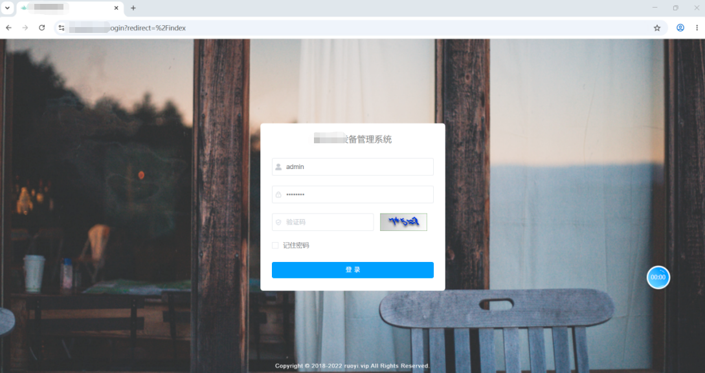
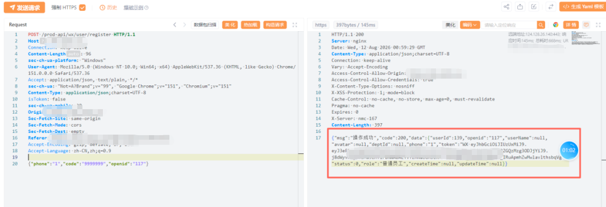
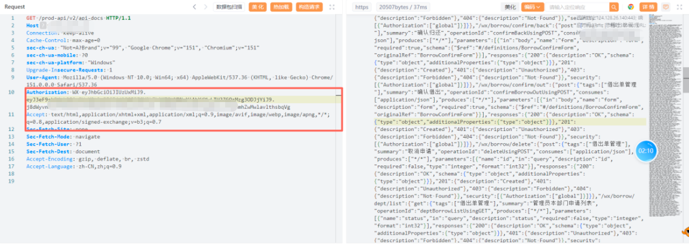
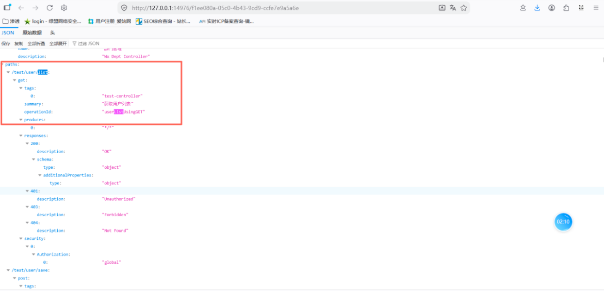
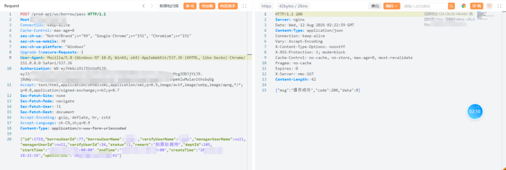
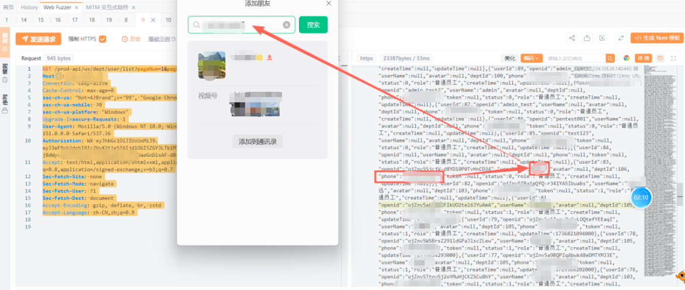
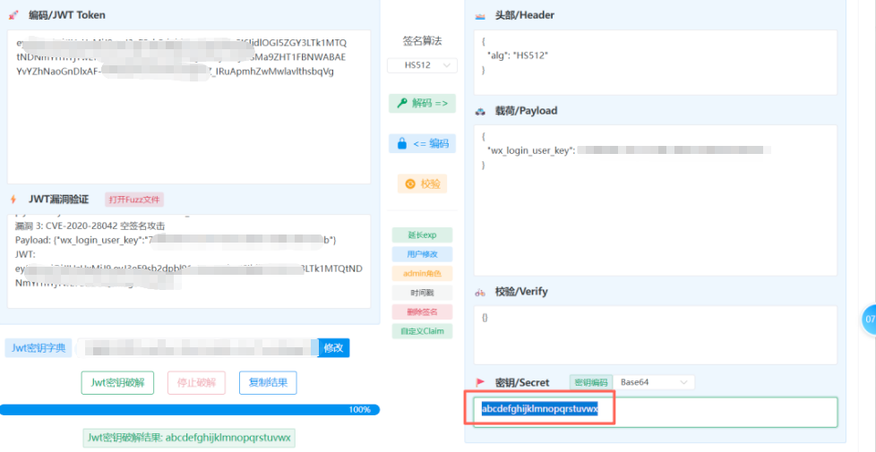
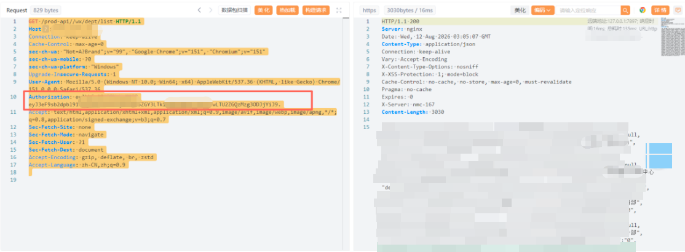

:::warning[授权声明]
本文整理自一次**授权攻防演练**的得分链，内容只讨论问题怎么串起来、根因在哪、该怎么修。
:::

靶标是某单位挂在公网上的**设备借用管理系统**：微信侧登记、部门审批、资产台账，后台是典型的前后端分离（Vue + 统一 `/prod-api` 网关，很像若依二次开发）。页面上只有登录，没有注册。

打起来入口很窄。后面证明，窄的只是前端。

## 这条链怎么走通

整条得分不靠 0day，靠的是四件事叠在一起：

1. **身份可以自己发。** 前端没入口，后端却留着注册接口，验证码形同虚设。
2. **攻击面被文档摊开。** 低权限 Token 就能拉到完整 Swagger，连测试控制器都在。
3. **有身份不等于有授权。** 普通员工能审单、能把人员/设备/工单列表一次性拉完。
4. **Token 本身也不可信。** JWT 弱密钥、空签名都能过，第一步其实都可以跳过。

## 一、没有注册页，却能成为员工

登录页只有账号密码。对前端未引用的路径做枚举后，微信模块里露出一个注册接口。

它收手机号、验证码、openid 一类字段，然后**立刻签发普通员工 JWT**。短信不校验，图形验证码没有，也没有频控。任意占位参数都能换到一张能用的票。

:::tip[怎么看这个问题]

前端路由不是安全边界。SPA 和小程序把按钮藏起来，接口还在网关上。更危险的是业务把「验证码字段」当成了「已经验证」——字段在 JSON 里出现，和运营商短信网关真正回了 OK，完全是两回事。
这类接口还经常带着若依风格的 `isToken: false`：网关层明确允许匿名。匿名可以，但匿名之后给出的不应该是**内部员工会话**。

:::

这一步的价值不是“又一个未授权接口”，而是**把外部人员变成内部低权限用户**。后面所有越权、拖库式列表，都站在这张票上。

## 二、Swagger 把地图交给你

用这张员工票访问接口文档（常见是 `/v2/api-docs` 或 `/swagger-ui`），文档完整返回。里面不仅有正式的借用、部门、设备接口，还有没下线的 **`/test/user/*` 控制器**。

测试接口用同一张普通员工票就能调，直接吐出后台管理员账号结构。等于在正式鉴权模型之外，又开了一扇给开发调试用的门。

:::important[生产环境开 Swagger 的真正危害]

很多人把 Swagger 暴露当成“信息泄露，中危打完收工”。在这条链里它的作用是**加速器**：隐藏注册解决“我是谁”，Swagger 解决“我还能打哪里”。没有文档也能撞路径，有文档则从枚举变成对照表，垂直越权的候选接口一目了然。

:::

## 三、普通员工能审批，也能把花名册拉走

对照文档去碰管理态接口，普通员工可以：

- 通过 / 驳回设备借用单
- 审批部门人员
- 用很大的 `pageSize` 拉部门员工、设备台账、历史申请、组织架构

量级是近百名员工资料、上百台设备、千余条申请记录。名单和工单内容都是真实业务数据，不是演示库。
这里使用注册的普通用户去执行借出单管理操作，发现可以审批通过。

**中间件验证了 JWT 签名（有时连签名都不验），没有按角色、部门、数据范围做强制授权。**

列表接口把分页上限交给客户端，等于用户可以把整张表拖走。部门维度的过滤如果只写在前端，或只过滤“当前登录人部门”却不校验 Token 里的部门，都会变成全量查询。

:::note[授权要问的三个问题]

一个带 Token 的请求进来，至少问三句：

1. 这张票是不是我签发的、有没有过期？（认证）
2. 这个角色有没有这个 API？（功能授权）
3. 这条 id / 这个部门的数据属不属于他？（数据授权）

:::

## 四、JWT 校验形同虚设

在已经能用正常员工票打穿业务的前提下，又测了 Token 机制本身：

- 签名密钥是可被字典打中的短字母弱密钥（配置里写死、没轮转）
- 截断签名、空签名的 Token 仍能访问部分接口

也就是说，前面的“先注册再越权”不是唯一打法。密钥可猜或算法可被降成 none 时，攻击者可以**伪造任意用户标识**，连注册都不必走。

:::caution[JWT 的两个经典坑]
空签名 / `alg=none` 吃的是实现：先 Base64 解码再决定验不验、或把“没签名”当成“验过了”。正确姿势是**算法白名单**（只接受 HS256/RS256 等），拒绝 `none`，签名字节为空直接丢。

弱密钥更常见。HS256 的密钥如果短、是键盘顺序、是项目名，和没签名区别不大。密钥应是足够长的随机字节，放在密钥管理系统里，而不是跟示例配置一起提交到仓库。
:::

演练里这类问题经常被单独报一条“JWT 攻击”。我更愿意把它看成认证底座塌了：上面的 RBAC 再精致也没有意义。

## 根因其实就三层

| 层 | 现场表现 | 真正缺的东西 |
|---|---|---|
| 入口 | 隐藏注册、无验证码、无频控 | 身份证明（短信/邀请码/SSO），而不是 JSON 里有个 code 字段 |
| 授权 | 员工审单、列表拉全表、测试控制器可用 | 接口级 RBAC + 数据范围 + 分页上限 |
| 令牌 | 弱密钥、空签名 | 强随机密钥、算法白名单、过期与吊销 |

框架侧还能对上几条若依二次开发的通病：生产网关没关 Knife4j/Swagger、`/test` 没剥离、匿名接口一签发就给内部角色、JWT 密钥沿用文档示例。框架能帮你把登录跑起来，**不会帮你设计这个单位的权限模型**。

## 修复可以很具体

按投入产出排，建议按这个顺序：

1. **立刻下线** 公网测试域上的 Swagger、Knife4j、`/test/**`，网关直接 404。
2. **关掉匿名注册**，或改成邀请码 / 管理员开通；验证码必须走短信网关校验结果，不能只校验字段非空。
3. **给每个管理接口挂权限字**，审批类接口再加：当前用户是否该单的审批人、单据状态是否允许流转。
4. **列表接口服务端封顶** `pageSize`，强制按部门或本人过滤，管理员接口与微信端员工接口拆开。
5. **轮换 JWT 密钥** 为长随机值，拒绝 `none` 与空签名，缩短有效期，敏感操作要求重新登录。

## 写在后面

这条链没有花哨的利用，得分点全是“默认配置 + 没做授权”。它在提醒两件事：

- **枚举前端没画出来的接口**，往往比盯着登录框爆破更值钱。
- **拿到最低权限之后不要停。** 身份有了，下一问永远是：这张票的边界在哪？

同类系统（资产台账、工单、值班、物资）几乎都是“微信端录入 + 管理端审批”。鉴权如果只拷了框架的登录示例，演练时会重复打出同一条链。
